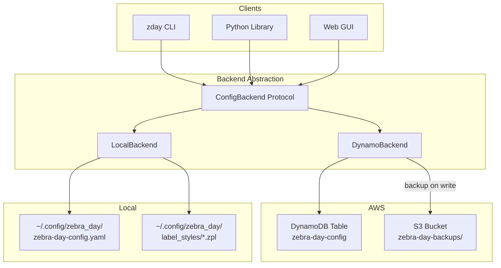

# AWS DynamoDB Shared Configuration Plan

> **Status**: DRAFT — pending approval before implementation
> **Author**: Forge
> **Date**: 2026-02-06
> **Scope**: `zebra_day` — shared printer config + ZPL templates via DynamoDB, with S3 backups

---

## 1. Problem Statement

Today, `zebra_day` stores printer configuration and ZPL templates as **local files** under `~/.config/zebra_day/`. This works for single-machine setups but breaks when multiple clients (Python scripts, web servers, CI runners, lab workstations) need to read and write the **same** fleet configuration.

### Goals

- Multiple clients share a single source of truth for printer config and templates.
- Local-file mode remains the default — DynamoDB is opt-in.
- Every DynamoDB mutation triggers an automatic S3 backup (JSON snapshots).
- DynamoDB can be bootstrapped from local config + template files.
- DynamoDB can be restored from S3 backups.
- No additional infrastructure required beyond DynamoDB + S3 (no Lambda, no Streams).

### Non-Goals

- Real-time push notifications to clients (poll or re-init instead).
- Multi-tenant / multi-fleet in a single table (one table = one fleet).
- Replacing local mode — it stays as the default forever.

---

## 2. Architecture Overview



### Backend Selection

Determined at `zpl()` init time via environment variable:

| `ZEBRA_DAY_CONFIG_BACKEND` | Behavior |
|----------------------------|----------|
| `local` (default)          | Current file-based behavior, unchanged |
| `dynamodb`                 | Read/write config + templates from DynamoDB |

---

## 3. DynamoDB Table Design

### Table: `zebra-day-config`

Single-table design. Partition key `PK` + sort key `SK` discriminate item types.

| Billing | On-Demand (pay-per-request) |
|---------|---------------------------|
| Region  | Configurable via `ZEBRA_DAY_DYNAMO_REGION` |
| Encryption | AWS-managed (SSE default) |
| Tags | `lsmc-cost-center`, `lsmc-project` (see §8) |

### Item Schema

#### 3a. Printer Configuration Item

| Attribute | Type | Value |
|-----------|------|-------|
| `PK`      | S    | `CONFIG` |
| `SK`      | S    | `printer_config` |
| `schema_version` | S | `2.1.0` |
| `config_data` | S | JSON-encoded full config dict |
| `version`  | N   | Monotonic version counter (for optimistic locking) |
| `updated_at` | S | ISO 8601 timestamp |
| `updated_by` | S | Client identifier (hostname, user, etc.) |

**Size estimate**: <10 KB for large fleets. Well within DynamoDB's 400 KB item limit.

#### 3b. Template Items

One item per template.

| Attribute | Type | Value |
|-----------|------|-------|
| `PK`      | S    | `TEMPLATE` |
| `SK`      | S    | Template stem, e.g. `tube_2inX1in` |
| `zpl_content` | S | Raw ZPL template text |
| `filename` | S   | `tube_2inX1in.zpl` |
| `size_bytes` | N | Content length |
| `version`  | N   | Monotonic version counter |
| `updated_at` | S | ISO 8601 timestamp |
| `updated_by` | S | Client identifier |

**Size estimate**: Largest template is ~1.7 KB. All 26 templates total ~20 KB. No chunking needed.

#### 3c. Metadata Item

| Attribute | Type | Value |
|-----------|------|-------|
| `PK`      | S    | `META` |
| `SK`      | S    | `table_info` |
| `created_at` | S | ISO 8601 timestamp |
| `created_by` | S | Client identifier |
| `last_backup_at` | S | ISO 8601 timestamp of last S3 backup |
| `last_backup_s3_key` | S | S3 key of most recent backup |
| `zebra_day_version` | S | Package version that created the table |

### Access Patterns

| Operation | Key Condition | Method |
|-----------|--------------|--------|
| Load config | `PK=CONFIG, SK=printer_config` | `GetItem` |
| Save config | `PK=CONFIG, SK=printer_config` | `PutItem` (conditional on `version`) |
| Get template | `PK=TEMPLATE, SK={name}` | `GetItem` |
| List templates | `PK=TEMPLATE` | `Query` (begins_with not needed; PK equality suffices) |
| Save template | `PK=TEMPLATE, SK={name}` | `PutItem` (conditional on `version`) |
| Delete template | `PK=TEMPLATE, SK={name}` | `DeleteItem` |
| Get metadata | `PK=META, SK=table_info` | `GetItem` |

No GSIs required. All access patterns are satisfied by the primary key.

---

## 4. S3 Backup Strategy

### Bucket and Key Layout

```
s3://{bucket}/{prefix}backups/
  {ISO-timestamp}/
    config.json            # Full printer config
    templates/
      tube_2inX1in.zpl     # One file per template
      generic_2inX1in.zpl
      ...
    manifest.json          # Backup metadata
```

### Trigger: Application-Side on Write

Every mutation through `DynamoBackend` triggers a backup **after** the DynamoDB write succeeds:

1. `save_config()` → write config to DDB → dump full snapshot to S3
2. `save_template()` → write template to DDB → dump full snapshot to S3
3. `delete_template()` → delete from DDB → dump full snapshot to S3

### Backup Throttling

To avoid excessive S3 writes during bulk operations (e.g., bootstrap), backups are **debounced**:

- Track `_last_backup_timestamp` on the backend instance.
- Skip backup if last backup was <60 seconds ago.
- `bootstrap` and `restore` commands force a single backup after all writes complete.
- Manual `zday dynamo backup` always executes immediately regardless of debounce.

### `manifest.json` Schema

```json
{
  "backup_timestamp": "2026-02-06T15:30:00Z",
  "zebra_day_version": "2.2.0",
  "schema_version": "2.1.0",
  "config_version": 42,
  "template_count": 26,
  "templates": [
    {"name": "tube_2inX1in", "size_bytes": 287, "version": 3},
    {"name": "generic_2inX1in", "size_bytes": 412, "version": 1}
  ],
  "triggered_by": "save_config",
  "client_id": "lab-workstation-7.local"
}
```

---

## 5. ConfigBackend Protocol

### Interface Definition

```python
from typing import Protocol, runtime_checkable

@runtime_checkable
class ConfigBackend(Protocol):
    """Backend protocol for zebra_day config + template storage."""

    # --- Config Operations ---

    def load_config(self) -> dict:
        """Load the full printer configuration dict.

        Returns:
            Config dict with 'schema_version', 'labs', etc.

        Raises:
            ConfigFileNotFoundError: If no config exists.
        """
        ...

    def save_config(self, config: dict) -> None:
        """Persist the full printer configuration dict.

        Args:
            config: Full config dict to save.
        """
        ...

    def config_exists(self) -> bool:
        """Check whether a config exists in the backend."""
        ...

    # --- Template Operations ---

    def get_template(self, name: str) -> str:
        """Load a template's ZPL content by stem name.

        Args:
            name: Template stem (e.g. 'tube_2inX1in').

        Returns:
            Raw ZPL string.

        Raises:
            LabelTemplateNotFoundError: If template not found.
        """
        ...

    def list_templates(self) -> list[str]:
        """List all template stem names.

        Returns:
            Sorted list of template stems.
        """
        ...

    def save_template(self, name: str, zpl_content: str) -> None:
        """Save or overwrite a template.

        Args:
            name: Template stem.
            zpl_content: Raw ZPL string.
        """
        ...

    def delete_template(self, name: str) -> None:
        """Delete a template by stem name.

        Raises:
            LabelTemplateNotFoundError: If template not found.
        """
        ...

    def template_exists(self, name: str) -> bool:
        """Check whether a template exists in the backend."""
        ...
```

### `LocalBackend`

Wraps the existing file I/O logic. Extracts the filesystem operations currently embedded
in `zpl.__init__()`, `save_printer_config()`, `resolve_template_path()`, etc. into a
standalone class that satisfies the `ConfigBackend` protocol.

**No behavioral change** — this is a refactor, not a rewrite. All existing tests continue
to pass against `LocalBackend`.

### `DynamoBackend`

Implements the same protocol against DynamoDB + S3.

```python
class DynamoBackend:
    def __init__(
        self,
        table_name: str = "zebra-day-config",
        region: str | None = None,
        s3_bucket: str | None = None,
        s3_prefix: str = "zebra-day/",
        client_id: str | None = None,
        cost_center: str | None = None,  # resolved from LSMC_COST_CENTER or "global"
        project: str | None = None,      # resolved from LSMC_PROJECT or "zebra-day+{region}"
    ):
        ...
```

Key behaviors:
- **Optimistic locking**: Every write uses `ConditionExpression` on `version` attribute.
  If a concurrent client incremented the version, the write fails with
  `ConditionalCheckFailedException`. The caller retries with a fresh read.
- **S3 backup**: After each successful write, triggers `_backup_to_s3()` (debounced).
- **Client ID**: Defaults to `{hostname}.{username}` for audit trail in `updated_by`.

---

## 6. `zpl()` Class Refactor

### Current State

The `zpl()` class directly embeds filesystem I/O:

- `__init__()` → calls `_load_config_file()` which reads YAML/JSON from disk
- `save_printer_config()` → writes YAML to disk + local backup
- `resolve_template_path()` → returns a `Path` on disk
- `get_template_content()` → reads file from resolved path
- `list_template_names()` → globs directories
- `save_template()` → writes file to disk
- `delete_template()` → unlinks file

### Proposed Change

Add a `backend` parameter to `zpl.__init__()`:

```python
class zpl:
    def __init__(
        self,
        config_path: str | None = None,
        backend: ConfigBackend | None = None,
    ):
        if backend is not None:
            self._backend = backend
        elif os.environ.get("ZEBRA_DAY_CONFIG_BACKEND", "local") == "dynamodb":
            self._backend = DynamoBackend.from_env()
        else:
            self._backend = LocalBackend(config_path=config_path)

        # Load config through backend
        self.printers = self._backend.load_config()
        ...
```

### Method Delegation

Each config/template method delegates to `self._backend`:

| `zpl` Method | Backend Call |
|--------------|-------------|
| `save_printer_config()` | `self._backend.save_config(self.printers)` |
| `resolve_template_path()` | `LocalBackend` only — raises if DynamoDB backend |
| `get_template_content()` | `self._backend.get_template(name)` |
| `list_template_names()` | `self._backend.list_templates()` |
| `save_template()` | `self._backend.save_template(name, content)` |
| `delete_template()` | `self._backend.delete_template(name)` |
| `formulate_zpl()` | Uses `get_template_content()` instead of `open(path)` |

**Note on `resolve_template_path()`**: This returns a filesystem `Path`, which is
meaningless in DynamoDB mode. Callers that need the *content* should use
`get_template_content()` instead. The `resolve_template_path()` method will remain
for backward compatibility but only works with `LocalBackend`. In `DynamoBackend`
it raises `NotImplementedError` with guidance to use `get_template_content()`.

### Backward Compatibility

- `zpl()` with no arguments → `LocalBackend` → identical to current behavior.
- `zpl(config_path="/some/path")` → `LocalBackend(config_path=...)` → identical.
- `zpl(backend=DynamoBackend(...))` → explicit DynamoDB mode.
- `ZEBRA_DAY_CONFIG_BACKEND=dynamodb` → auto-creates `DynamoBackend` from env vars.

---

## 7. CLI Commands

### New Subcommand Group: `zday dynamo`

```
zday dynamo init          Create DynamoDB table and S3 bucket
zday dynamo status        Show table/bucket status and item counts
zday dynamo bootstrap     Push local config + templates → DynamoDB
zday dynamo export        Pull DynamoDB config + templates → local files
zday dynamo backup        Trigger immediate S3 backup snapshot
zday dynamo restore       Restore DynamoDB from an S3 backup
zday dynamo destroy       Delete DynamoDB table (requires --yes)
```

### Command Details

#### `zday dynamo init`

```
Options:
  --table-name TEXT    DynamoDB table name [default: zebra-day-config]
  --region TEXT        AWS region [default: from env or us-east-1]
  --s3-bucket TEXT     S3 bucket for backups [required]
  --s3-prefix TEXT     S3 key prefix [default: zebra-day/]
  --profile TEXT       AWS profile name [default: from env; never "default" explicitly]
  --cost-center TEXT   lsmc-cost-center tag [default: from LSMC_COST_CENTER or "global"]
  --project TEXT       lsmc-project tag [default: from LSMC_PROJECT or "zebra-day+{region}"]
```

Actions:
1. Create DynamoDB table with `PK` (S) + `SK` (S) key schema, on-demand billing.
2. Tag the DynamoDB table with `lsmc-cost-center` and `lsmc-project`.
3. Wait for table to become `ACTIVE`.
4. Create S3 bucket if it doesn't exist (same region).
5. Tag the S3 bucket with `lsmc-cost-center` and `lsmc-project`.
6. Write `META#table_info` item with creation metadata.
7. Print env var export commands for the user to set.

#### `zday dynamo bootstrap`

```
Options:
  --config-file PATH   Source config file [default: XDG config path]
  --templates-dir PATH Source templates directory [default: XDG label_styles + package]
  --include-package    Include package-shipped templates [default: true]
```

Actions:
1. Read local config file → write as `CONFIG#printer_config` item.
2. Read all `.zpl` files from templates dir → write each as `TEMPLATE#{stem}` item.
3. Trigger a single S3 backup after all writes complete.
4. Print summary: items written, backup S3 key.

#### `zday dynamo export`

```
Options:
  --output-dir PATH    Target directory [default: ./zebra-day-export/]
  --format TEXT        Config format: json or yaml [default: json]
```

Actions:
1. Read `CONFIG#printer_config` → write to `{output-dir}/config.{format}`.
2. Query all `TEMPLATE#*` items → write each to `{output-dir}/templates/{name}.zpl`.
3. Print summary.

#### `zday dynamo backup`

No required options. Uses env vars for table/bucket/region.

Actions:
1. Read all items from DynamoDB.
2. Write snapshot to S3 (config.json + templates/ + manifest.json).
3. Update `META#table_info` with `last_backup_at` and `last_backup_s3_key`.
4. Print S3 key of the backup.

#### `zday dynamo restore`

```
Options:
  --s3-key TEXT        S3 key prefix of the backup to restore [required]
  --list               List available backups instead of restoring
  --yes                Skip confirmation prompt
```

Actions (with `--list`):
1. List S3 prefixes under `{prefix}backups/`, print timestamps and manifest summaries.

Actions (without `--list`):
1. Download `manifest.json` from the specified S3 key.
2. Download `config.json` → write to DynamoDB as `CONFIG#printer_config`.
3. Download each `templates/*.zpl` → write to DynamoDB as `TEMPLATE#{stem}`.
4. Trigger a fresh backup (post-restore snapshot).

#### `zday dynamo destroy`

```
Options:
  --yes                Required. Safety gate.
```

Actions:
1. Trigger final S3 backup.
2. Delete DynamoDB table.
3. Print: "Table deleted. Backups preserved in S3."

#### `zday dynamo status`

No options. Reads from env vars.

Output:
```
DynamoDB Shared Config Status

  Table:       zebra-day-config
  Region:      us-west-2
  Status:      ACTIVE
  Items:       28 (1 config + 26 templates + 1 meta)

  S3 Bucket:   my-zebra-backups
  S3 Prefix:   zebra-day/
  Last Backup: 2026-02-06T10:30:00Z
  Backups:     14

  Config Version:  42
  Last Updated:    2026-02-06T10:25:00Z
  Last Updated By: lab-ws-3.jdoe
```


---

## 8. Environment Variables

| Variable | Default | Description |
|----------|---------|-------------|
| `ZEBRA_DAY_CONFIG_BACKEND` | `local` | Backend selection: `local` or `dynamodb` |
| `ZEBRA_DAY_DYNAMO_TABLE` | `zebra-day-config` | DynamoDB table name |
| `ZEBRA_DAY_DYNAMO_REGION` | `us-east-1` | AWS region for DynamoDB and S3 |
| `ZEBRA_DAY_S3_BACKUP_BUCKET` | *(none — required for dynamodb)* | S3 bucket for backups |
| `ZEBRA_DAY_S3_BACKUP_PREFIX` | `zebra-day/` | S3 key prefix |
| `ZEBRA_DAY_CLIENT_ID` | `{hostname}.{username}` | Client identifier for audit trail |
| `LSMC_COST_CENTER` | `global` | AWS resource tag: `lsmc-cost-center` |
| `LSMC_PROJECT` | `zebra-day+{region}` | AWS resource tag: `lsmc-project` |
| `AWS_PROFILE` | *(from env — never explicit `"default"`)* | Standard AWS credential selection |
| `AWS_DEFAULT_REGION` | *(none)* | Fallback region if `ZEBRA_DAY_DYNAMO_REGION` not set |

### AWS Resource Tagging

All AWS resources created by `zebra_day` **must** be tagged with:

| Tag Key | Resolution Order | Fallback |
|---------|-----------------|----------|
| `lsmc-cost-center` | 1. CLI `--cost-center` flag → 2. `LSMC_COST_CENTER` env var → 3. `"global"` | `global` |
| `lsmc-project` | 1. CLI `--project` flag → 2. `LSMC_PROJECT` env var → 3. `"zebra-day+{region}"` | `zebra-day+us-east-1` |

Tags are applied to:
- DynamoDB table (at creation via `Tags` parameter, and on existing tables via `TagResource`)
- S3 bucket (at creation via `Tagging`, and on existing buckets via `put_bucket_tagging`)

### AWS Profile Rules

- `AWS_PROFILE` may be used to select credentials.
- Code **must never** pass `profile_name="default"` explicitly to boto3 sessions or clients.
- If no profile is specified, boto3's standard credential chain is used (env vars → instance role → config file).

### Validation at Init

When `ZEBRA_DAY_CONFIG_BACKEND=dynamodb`:

1. `ZEBRA_DAY_S3_BACKUP_BUCKET` **must** be set. Fail fast with clear error if missing.
2. AWS credentials must be resolvable (via profile, env vars, or instance role). Test with `sts:GetCallerIdentity` at init. Fail fast if not.
3. DynamoDB table must exist. If not, print: `"Table not found. Run 'zday dynamo init' first."`

---

## 9. Offline / Fallback Behavior

### Design Principle

**Fail loudly, don't silently degrade.**

If a client is configured for `dynamodb` backend but DynamoDB is unreachable:

1. **On init**: Raise `ConfigError` with clear message. Do not silently fall back to local.
2. **On write**: Raise immediately. Do not buffer or queue.
3. **On read (after successful init)**: The config is already loaded in memory (`self.printers`). Reads from the in-memory dict work fine. Only re-reads (refresh) would fail.

### Optional Local Cache (Future Enhancement)

A future version could add `ZEBRA_DAY_DYNAMO_CACHE=true` to:
- Cache the last-known-good config + templates locally
- Serve from cache if DynamoDB is unreachable
- Mark the instance as "stale" in logs

This is **not in scope** for the initial implementation. Keep it simple: DynamoDB mode requires DynamoDB.

---

## 10. Dependency Management

### New Optional Dependency Group

```toml
[project.optional-dependencies]
aws = [
    "boto3>=1.26.0",
]
auth = [
    "daylily-cognito>=0.1.10",
    "python-jose[cryptography]>=3.3.0",
    "boto3>=1.26.0",
]
```

The `aws` group contains only `boto3`. The `auth` group already has `boto3` so there's
overlap — that's fine, pip handles deduplication. Users who want DynamoDB without Cognito
install `pip install zebra_day[aws]`.

### Import Guard

`DynamoBackend` imports `boto3` lazily:

```python
class DynamoBackend:
    def __init__(self, ...):
        try:
            import boto3
        except ImportError:
            raise ImportError(
                "boto3 is required for DynamoDB backend. "
                "Install with: pip install zebra_day[aws]"
            ) from None
        self._ddb = boto3.resource("dynamodb", region_name=region)
        self._s3 = boto3.client("s3", region_name=region)
        ...
```

---

## 11. Testing Strategy

### Unit Tests (moto mocks)

Use [`moto`](https://github.com/getmoto/moto) to mock DynamoDB and S3 in-process.
No AWS credentials or network required.

```python
import pytest
from moto import mock_aws

@pytest.fixture
def dynamo_backend():
    with mock_aws():
        # Create table, bucket
        import boto3
        ddb = boto3.resource("dynamodb", region_name="us-east-1")
        ddb.create_table(
            TableName="zebra-day-config",
            KeySchema=[
                {"AttributeName": "PK", "KeyType": "HASH"},
                {"AttributeName": "SK", "KeyType": "RANGE"},
            ],
            AttributeDefinitions=[
                {"AttributeName": "PK", "AttributeType": "S"},
                {"AttributeName": "SK", "AttributeType": "S"},
            ],
            BillingMode="PAY_PER_REQUEST",
        )
        s3 = boto3.client("s3", region_name="us-east-1")
        s3.create_bucket(Bucket="test-backup-bucket")

        from zebra_day.backends.dynamo import DynamoBackend
        backend = DynamoBackend(
            table_name="zebra-day-config",
            region="us-east-1",
            s3_bucket="test-backup-bucket",
        )
        yield backend
```

### Test Matrix

| Test | Backend | What It Validates |
|------|---------|-------------------|
| `test_load_config_local` | `LocalBackend` | Existing behavior preserved |
| `test_save_config_local` | `LocalBackend` | Existing save + backup behavior |
| `test_load_config_dynamo` | `DynamoBackend` | Config round-trip through DDB |
| `test_save_config_dynamo` | `DynamoBackend` | Config write + S3 backup trigger |
| `test_optimistic_lock_conflict` | `DynamoBackend` | Version collision raises error |
| `test_list_templates_dynamo` | `DynamoBackend` | Query returns all template stems |
| `test_save_template_dynamo` | `DynamoBackend` | Template write + S3 backup |
| `test_delete_template_dynamo` | `DynamoBackend` | Delete + S3 backup |
| `test_bootstrap_local_to_dynamo` | Both | Full migration path |
| `test_export_dynamo_to_local` | Both | Full export path |
| `test_restore_from_s3` | `DynamoBackend` | S3 → DDB restore |
| `test_backup_debounce` | `DynamoBackend` | Rapid writes produce ≤1 backup |
| `test_missing_boto3` | — | ImportError with guidance |
| `test_missing_env_vars` | — | ConfigError with guidance |
| `test_table_not_found` | `DynamoBackend` | Clear error message |
| `test_zpl_init_with_backend` | Both | `zpl(backend=...)` works |
| `test_zpl_env_var_selection` | Both | `ZEBRA_DAY_CONFIG_BACKEND` selects correctly |
| `test_formulate_zpl_dynamo` | `DynamoBackend` | Template rendering works without filesystem |
| `test_resource_tagging` | `DynamoBackend` | DDB table + S3 bucket tagged with `lsmc-cost-center` and `lsmc-project` |
| `test_tag_resolution_order` | `DynamoBackend` | CLI flag → env var → default fallback chain |
| `test_no_explicit_default_profile` | — | boto3 never called with `profile_name="default"` |

### Test Dependencies

Add to `[project.optional-dependencies]`:

```toml
dev = [
    ...existing...
    "moto[dynamodb,s3]>=5.0.0",
]
```

### CLI Tests

Test each `zday dynamo` subcommand using `typer.testing.CliRunner` with moto mocks.
Each command gets at least one happy-path and one error-path test.

---

## 12. Implementation Phases

### Phase 1: Backend Abstraction (no AWS yet)

**Goal**: Extract file I/O from `zpl()` into `LocalBackend` without changing behavior.

| Deliverable | Description |
|-------------|-------------|
| `zebra_day/backends/__init__.py` | `ConfigBackend` protocol definition |
| `zebra_day/backends/local.py` | `LocalBackend` class wrapping existing file I/O |
| Refactored `print_mgr.py` | `zpl()` delegates to `self._backend` |
| Updated existing tests | All 167+ tests pass against `LocalBackend` |

**Risk**: Low. Pure refactor. Every test must pass before proceeding.

### Phase 2: DynamoBackend Implementation

**Goal**: Implement `DynamoBackend` with full CRUD + S3 backup.

| Deliverable | Description |
|-------------|-------------|
| `zebra_day/backends/dynamo.py` | `DynamoBackend` class |
| S3 backup logic | Snapshot on write with debounce |
| Optimistic locking | Conditional writes on `version` attribute |
| New test file | `tests/test_dynamo_backend.py` using moto |

**Risk**: Medium. New AWS integration. Thoroughly tested with moto.

### Phase 3: CLI Commands

**Goal**: `zday dynamo` subcommand group with all 7 commands.

| Deliverable | Description |
|-------------|-------------|
| `zebra_day/cli/dynamo.py` | Typer subcommand group |
| Updated `zebra_day/cli/__init__.py` | Register `dynamo_app` |
| CLI test file | `tests/test_cli_dynamo.py` |

### Phase 4: Web GUI Integration

**Goal**: Web server works transparently with DynamoDB backend.

| Deliverable | Description |
|-------------|-------------|
| Updated `web/app.py` | `create_app()` respects `ZEBRA_DAY_CONFIG_BACKEND` |
| Updated API router | All endpoints work through backend abstraction |
| Integration tests | Web API tests with moto-backed DynamoDB |

### Phase 5: Documentation + Release

| Deliverable | Description |
|-------------|-------------|
| Updated `README.md` | DynamoDB setup section |
| Updated CLI docs | `zday dynamo` command reference |
| Release notes | Changelog for new feature |

---

## 13. File Layout (New Files)

```
zebra_day/
  backends/
    __init__.py          # ConfigBackend protocol + get_backend() factory
    local.py             # LocalBackend (extracted from print_mgr.py)
    dynamo.py            # DynamoBackend (new)
  cli/
    dynamo.py            # zday dynamo subcommands (new)
tests/
  test_backend_local.py  # LocalBackend-specific tests
  test_backend_dynamo.py # DynamoBackend tests (moto)
  test_cli_dynamo.py     # CLI command tests (moto)
```

---

## 14. IAM Permissions

### Minimum IAM Policy for Clients

```json
{
  "Version": "2012-10-17",
  "Statement": [
    {
      "Sid": "DynamoDBAccess",
      "Effect": "Allow",
      "Action": [
        "dynamodb:GetItem",
        "dynamodb:PutItem",
        "dynamodb:DeleteItem",
        "dynamodb:Query",
        "dynamodb:DescribeTable"
      ],
      "Resource": "arn:aws:dynamodb:*:*:table/zebra-day-config"
    },
    {
      "Sid": "S3BackupAccess",
      "Effect": "Allow",
      "Action": [
        "s3:PutObject",
        "s3:GetObject",
        "s3:ListBucket"
      ],
      "Resource": [
        "arn:aws:s3:::BUCKET_NAME",
        "arn:aws:s3:::BUCKET_NAME/zebra-day/*"
      ]
    }
  ]
}
```

### Additional Permissions for `zday dynamo init`

```json
{
  "Sid": "DynamoDBAdmin",
  "Effect": "Allow",
  "Action": [
    "dynamodb:CreateTable",
    "dynamodb:DeleteTable",
    "dynamodb:DescribeTable"
  ],
  "Resource": "arn:aws:dynamodb:*:*:table/zebra-day-config"
},
{
  "Sid": "S3BucketAdmin",
  "Effect": "Allow",
  "Action": [
    "s3:CreateBucket",
    "s3:HeadBucket"
  ],
  "Resource": "arn:aws:s3:::BUCKET_NAME"
},
{
  "Sid": "STSIdentity",
  "Effect": "Allow",
  "Action": "sts:GetCallerIdentity",
  "Resource": "*"
}
```

---

## 15. Cost Estimate

| Resource | Usage Pattern | Estimated Monthly Cost |
|----------|---------------|----------------------|
| DynamoDB (on-demand) | <100 reads/writes per day | **$0.00** (free tier: 25 RCU + 25 WCU) |
| DynamoDB storage | <1 MB | **$0.00** |
| S3 storage | ~50 MB/month (365 daily backups × ~140 KB each) | **$0.01** |
| S3 requests | ~100 PUTs + ~10 GETs per day | **$0.01** |
| **Total** | | **~$0.02/month** |

Effectively free for any reasonable usage pattern.

---

## 16. Rollback Plan

### Reverting from DynamoDB to Local

1. Run `zday dynamo export --output-dir ./export/` to pull everything to local files.
2. Copy `./export/config.json` to `~/.config/zebra_day/zebra-day-config.yaml` (convert format).
3. Copy `./export/templates/*.zpl` to `~/.config/zebra_day/label_styles/`.
4. Unset `ZEBRA_DAY_CONFIG_BACKEND` or set to `local`.
5. Restart any running services.

### Reverting the Code

Since `LocalBackend` is just a refactor of existing behavior, reverting Phase 2+ leaves
Phase 1 (the abstraction layer) in place with zero behavioral change. The `LocalBackend`
code path is tested against the full existing test suite.

---

## 17. Open Questions

| # | Question | Default Assumption | Impact |
|---|----------|--------------------|--------|
| 1 | Multi-tenancy (multiple fleets in one table)? | No — one table per fleet | Low. Can add `TENANT_ID` prefix to PK later. |
| 2 | Template versioning (history of changes)? | No — only current version | Low. S3 backups provide de-facto history. |
| 3 | Read-only clients (no write permissions)? | All clients are read-write | Low. IAM can restrict per-client. |
| 4 | DynamoDB point-in-time recovery (PITR)? | Enabled by default on `init` | Cost: ~$0.20/GB/month (negligible for <1 MB). |
| 5 | S3 lifecycle policy (auto-delete old backups)? | Not set by default. User configures. | Prevents unbounded S3 growth. |

---

## 18. Summary

This plan adds **opt-in DynamoDB shared configuration** to `zebra_day` while preserving
local-file mode as the default. The implementation is split into 5 phases, starting with a
zero-risk refactor (Phase 1) that introduces the backend abstraction without any AWS
dependency. Each subsequent phase adds capability incrementally.

Key design decisions:
- **Single-table DynamoDB design** — simple, no GSIs, all access patterns on primary key.
- **Application-side S3 backups** — no Lambda, no Streams, no extra infrastructure.
- **Optimistic locking** — safe concurrent access without distributed locks.
- **Fail-loud offline behavior** — no silent degradation.
- **moto-based testing** — full test coverage without AWS credentials.