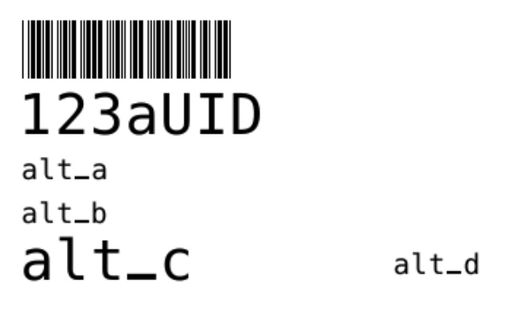

## zebra_day Overview 
<ul>


### It Is 3+ Things

  (1) Zebra Printer Management & Configuration

  (2) ZPL Label Template Tools

  (3) A Python Library To Manage Formulating & Sending Label Print Requests

  (bonuses)
    * a web gui to make some of the above more approachable && expose (3) as a http API.
    * Documentation sufficent for organization to successfuly assemble & deploy a reasonalbly sized barcoding system in your operational environment in potentially weeks.
      * ... and cheaply! a 10 printer install could cost ~$5,000.00 in purchases.  With ongoing operational expenses of ~$150/mo (depends on label stock consumption mostly).

### And It Is Not

* _An Identify Generating Authority_
  * you will need to produce your own UID/GUID/etc. This can be manual, spreadsheets, custom code, various RDBMS, LIMS systems, Salesforce... but should not be tangled in this package.
    * also, METADATA regaring your UID is important as these metadata can be presented on the labels in addition to the human readable and scannable UID. [Insert Unique Identifier Reccomendations Here](na).

</ul>

## Getting Started

<ul>
  
### Quickest Start :: Daylily Orchestrated Build and Deploy ( deliverable in a month, given minimal externally driven delays)
* [Daylily is available to lead or contribute to the building and deployment of universal barcoding systems to your organizations operations](https://www.linkedin.com/in/john--major/). Daylily offers expertise with the entire process from evaluating existing operations systems, proposing integration options, securing all hardware, deploying hardware and software, and importantly: connecting newly deployed barcoding services to other LIS systems.

#### Universal Barcoding Capability Project Timing Estimates
<ul><ul>
> 
</ul></ul>

### Requirements
* Tested and runs on MAC and Ubuntu (but other flavors of Linux should be no problem). Windows would be a rather large hassle, though presumably possible (not advised).
* [conda](https://conda.io/projects/conda/en/latest/user-guide/install/index.html#regular-installation) and [mamba](https://anaconda.org/conda-forge/mamba) installed. This is not, in fact, a blocking requirement, but other env setups have not been tested yet.  __for MAC users, it may be advisable to install conda with homebrew__.
  * create conda environment `ZDAY`, which will be used to run the UI
    ```bash
    mamba create -n ZDAY -c conda-forge python==3.10 pip ipython
    ```

### Install From PIP
you can pip install `zebra_day` to any python environment running 3.10.*, which for purely programatic use is unlikely to be a problem.  If you plan to run the web UI or use the HTTP API functionality, run this in the above described `ZDAY` conda env.  To install with pip:

* COMING SOON... but should soon be `pip install zebra_day`


### Install From Source

#### Clone Repository & Local PIP

*  [From github via ssh](https://github.com/Daylily-Informatics/zebra_day)

```bash
git clone git@github.com:Daylily-Informatics/zebra_day.git
cd zebra_day
conda activate ZDAY  # ZDAY was built with mamba earlier
python setup.py sdist
pip install dist/PATH_TO_HIGHEST_VERSIONED_FILE
```

* `zebra_day` is now installed in your current python environment.

<br><br><br>

</ul>


# USAGE

<ul>
  
## Hardware Config
### Quick
* Connect all zebra printers to the same network the machine you'll be running `zebra_day` is connected to. Load labels, power printers on, confirm status lights are green.

### [Hardware Config Guide](docs/hardware_config_guide.md)

<br><br>
  

## Programatic
### Quick

Open an ipython shell
```python
import zebra_day.print_mgr as zdpm

zlab = zdpm.zpl()

zlab.probe_zebra_printers_add_to_printers_json('192.168.1')  # REPLACE the IP stub with the correct value for your network. This may take a few min to run.

print(zlab.printers)  # This should print out the json dict of all detected zebra printers. An empty dict, {}, is a failure of autodetection, and manual creation of the json file may be needed. If successful, the lab name assigned is 'scan-results', this may be edited latter.
# The json will loook something like this
## {'labs': {'scan-results': {'192.168.1.7': {'ip_address': '192.168.1.7', 'label_zpl_styles': ['test_2inX1in'], 'print_method': 'unk'}}}
##               'lab' name     'printer' name(can be edited latter)                              label_zpl_style

# Assuming a printer was detected, send a test print request.  Using the 'lab', 'printer' and 'label_zpl_style' above (you'd have your own IP/Name, other values should remain the same for now.  There are multiple label ZPL formats available, the test_2inX1in is for quick testing & only formats in the two UID values specified.

zlab.print_zpl(lab='scan-results', printer_name='192.168.1.7', label_zpl_style='test_2inX1in', uid_barcode="123aUID", uid_human_readable="123aUID")
# ZPL code sent successfully to the printer!
# Out[13]: '^XA\n^FO235,20\n^BY1\n^B3N,N,40,N,N\n^FD123aUID^FS\n^FO235,70\n^ADN,30,20\n^FD123aUID^FS\n^FO235,115\n^ADN,25,12\n^FDalt_a^FS\n^FO235,145\n^ADN,25,12\n^FDalt_b^FS\n^FO70,180\n^FO235,170\n^ADN,30,20\n^FDalt_c^FS\n^FO490,180\n^ADN,25,12\n^FDalt_d^FS\n^XZ'
```

* This will produce a label which looks like this (modulo printer config items needing attention).
  


### [Programatic Guide](docs/programatic_guide.md)


<br><br>


## Web UI

### Quick Start
* Start the `zebra_day` service.

```bash
# consider running this via tmux or screen
conda activate ZDAY
python bin/zserve.py  # This service will continue running until stopped or until it crashes. Access and error logs are printed to STDout/err.

# ctrl-c to shutdown the web service

```

* The web UI should now be accessible at `YOUR.HOST.IP.ADDR:8118`, or if physically on the box you're running the service on, `localhost:8118`.
  * Unreachable?  Are the ports open?  Is the python cherrypy service started above still running, or has it exited?

* You can send a label print request via the UI (the process is a little involved ATM)... also, you can send the service requests via HTTP, ie, the programatic print request from above, can be similarly accomplished with this URL

```http
http://YOUR.HOST.IP.ADDR:8118/_print_label?lab=scan-results&printer=192.168.1.7&printer_ip=192.168.1.7&label_zpl_style=test_2inX1in&uid_barcode=123aUID&uid_human_readable=123aUID&alt_a=&alt_b=&alt_c=&alt_d=&alt_e=&alt_f=
```

_or_ with the unused (in this ZPL template!) fields removed, this URL

```http
http://YOUR.HOST.IP.ADDR:8118/_print_label?lab=scan-results&printer=192.168.1.7&printer_ip=192.168.1.7&label_zpl_style=test_2inX1in&uid_barcode=123aUID&uid_human_readable=123aUID
```

* There will be more details on the web tools available via this GUI in the `Web UI Guide`.

### [Web UI Guide](docs/zebra_day_ui_guide.md)


<br><br>

</ul>


# Other Topics

## Security
* There is no need to route print requests outside the immediate network all of the local printers reside in.
* This package only manages the mechanics of printing data to zebra printers, and some amount of printer and label format management. WHAT you print, will likely involve a UID issuing authority, which will need to be able to send print jobs to the API server, or if using the zebra_day package directly in python, should be able to see the label printing network(s).
* No Cloud traversal is needed (or encouraged in this case).

## Hardware

### Zebra Printers
* Printers will need to be able to secure an IP address either via a wired connection or via wireless.  The printers will need to be visible to the machine running this package to accept print requests. Further, there are rudimentary tools for automatically detecting Zebra printers already on the network and assigned IPs.  These tools can only scan (i think...) the IP root it is assigned itself.  Configuring VPNs and so on are outside the scope of this document.
  * Network attached printers should be able to run w/out any connection to a PC/laptop. This affors much greater flexibility in placing print stations.
* This code will not be able to see, or interact with, zebra printers only connected to a specific machine via USB.
* The below zebra printer models have been tested, but any zebra printer able to obtain an IP address and accept `ZPL` should also work.
* _IMPORTANT_, I have not fleshed out a section on how to configure the zebra printers onboard setting when first setting them up.
  * Each printer has a web admin interface you can reach by pointing a web browser to it's IP address. The zebra_day simple tools UI has a page which will detect and then list all zebra printers it sees.  Links are presented to bring you to these admin pages.  _please see the zebra docs before messing with these too much_.
    * To change settings, if prompted for a un/pw, they will all be: `admin` and `1234`.
  * The first thing I suggest when setting up a new printer is resetting the factory defaults - doable via the zebra printer admin UIs.
  * Wired ethernet connections are advised for greater robustness.  Configure the wired network settings to obtain an IP automatically.  _I SUGGEST_ asking your network admins to set DNS rules which will assign the same IP to each printer.  You'll need to supply the printer MAC address to do this.
    * Wireless setup is _SUPER_ fussy. You'll need to know precisely what bands your router is running on, and the precise auth used. This can be done via the zebra printer admin UI, or when connected via a USB cable to a computer running a driver config program(not advised really).
  * The Zebra Printer admin pages will report the MAC for the printer.
  * Next, you may have to mess around with calibration settings for label width and length.
  * I have used this driver/config tool on a MAC when I have needed to connect to a printer via `USB`, [Peninsula Zebra Printer Driver](https://www.peninsula-group.com/install-zebra-printer-mac-osx/install-zebra-printer-mac-osx.html).
  * More to come... I'll add screenshots of config for the few models I have tested at some point.


#### GX420d - wired, no LCD screen
These printers are NOT reccomended b/c the lack of LCD screen makes them a pain to configure.  You will probably need to connect via USB to set good initial settings.  If you have the `zebra_day` UI running, try connecting the printer to the network and powering on, then run the zebra printer network scan.  If the printer is discovered, you're in luck and can admin it via the UI on the printer.

* [Available From Amazon](https://www.amazon.com/gp/product/B07KCQ67Y1/ref=ppx_yo_dt_b_search_asin_title?ie=UTF8&psc=1)
* Cost per printer : `$264.00`


#### GX420d - wired, with LCD screen
These are solid, but aging out and not as easy to find for sale.

* [Available From Amazon](https://www.amazon.com/gp/product/B011Q95XX2/ref=ppx_yo_dt_b_search_asin_title?ie=UTF8&psc=1)
* Cost per printer : `$425.00`


#### ZD620d - wired and wireless, with color LCD screen
These are solid, but aging out and not as easy to find for sale.

* [Available From Amazon](https://www.amazon.com/gp/product/B07VHDR33Z/ref=ppx_yo_dt_b_search_asin_title?ie=UTF8&psc=1)
* Cost per printer : `$331.00`


### Label Stock
The label stock used to date are `direct thermal transfer`, with some speciality label stock vendors for use in more extreme conditions. The printing method used by printers that `zebra_day` can interact with has no impact on if the printer will work.  Printers using different printing methods may be mixed in the printer fleet described in the `printers.json`. It is up to you to ensure that printers using a specific method have the appropriate label stock, and ribbons if necessary.

#### Aegis Direct Thermal Labels
For general purpose use. Very inexpensive and easy to source.

##### 2in x 1in
Good for paperwork, some larger tubes.

* [Available On Amazon](https://www.amazon.com/gp/product/B01GJGC2OK/ref=ppx_yo_dt_b_search_asin_title?ie=UTF8&th=1)
* Cost per roll : `$3.21`

##### 2in x 0.5in
Good for smaller tubes, or tubes that already have space taken up by labels.

* [Available On Amazon](https://www.amazon.com/gp/product/B098Z8JYZC/ref=ppx_yo_dt_b_search_asin_title?ie=UTF8&th=1)
* Cost per roll : `$3.25`

#### Labtag

##### 2in x 1in


##### plate style

##### small tube w/dot


### Barcode Scanners

#### Tera 1d, 2d, QR  scanner. Corded and bluetooth and wireless
Programable and well supported/adopted.

* [Available From Amazon](https://www.amazon.com/dp/B0953FJZDG?psc=1&ref=ppx_yo2ov_dt_b_product_details)
* Cost per scanner : `$63.00`

#### Tera Mini 1d 2d QR. Corded and wireless and bluetooth.
_experimenting_... tiny handheld pretty well behaving non-corded scanner.

* [Available From Amazon](https://www.amazon.com/dp/B08NDFWFKJ?psc=1&ref=ppx_yo2ov_dt_b_product_details)
* Cost per Scanner : `$38.00`

