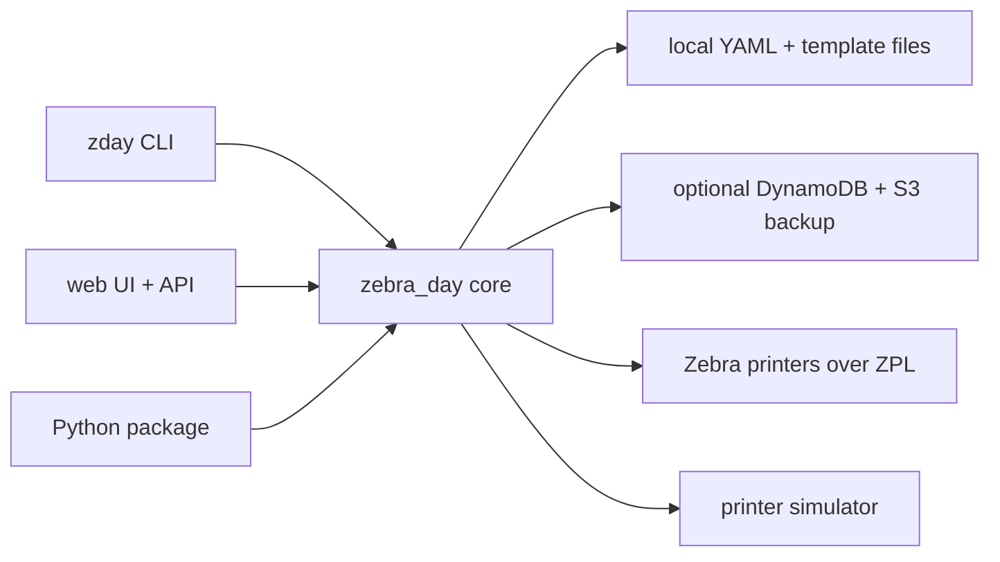

[](https://github.com/Daylily-Informatics/zebra_day/releases/latest)
[](https://github.com/Daylily-Informatics/zebra_day/tags)
[](https://github.com/Daylily-Informatics/zebra_day/actions/workflows/main.yaml)

# zebra_day

`zebra_day` is a Python library, CLI, simulator, and FastAPI web UI for managing Zebra printer fleets and serving ZPL print workflows. It is designed for local-lab use first, but it can also run with shared DynamoDB-backed configuration and S3 backups when multiple machines need the same printer and template inventory.

zebra_day owns:
- printer discovery and fleet configuration
- ZPL template storage and preview/edit flows
- print submission and printer status surfaces
- local-file and DynamoDB-backed config backends
- simulator support for testing without physical printers

zebra_day does not own:
- broader LIMS object truth
- shipment or accessioning workflow authority
- non-Zebra printing ecosystems

## Component View


```mermaid
flowchart LR
    CLI["zday CLI"] --> Core["zebra_day core"]
    Web["web UI + API"] --> Core
    Py["Python package"] --> Core
    Core --> Local["local YAML + template files"]
    Core --> Dynamo["optional DynamoDB + S3 backup"]
    Core --> Printers["Zebra printers over ZPL"]
    Core --> Sim["printer simulator"]
```

## Prerequisites

- Python 3.10+
- network reachability to one or more Zebra printers for live use
- optional mkcert for HTTPS-by-default local GUI
- optional AWS credentials for DynamoDB/S3-backed shared configuration

## Getting Started

### Quickstart

```bash
source ./zday_activate
zday bootstrap
zday gui start
```

The default GUI port is `8118`. If local certificates are available, HTTPS is used by default.

## Architecture

### Technology

- Python package and CLI built on `cli-core-yo`
- FastAPI + Jinja2 web UI
- ZPL over TCP for printer communication
- optional DynamoDB + S3 backend for shared configuration

### Core Config Model

The repo centers on:

- labs
- printers
- label styles/templates
- backend selection (`local` or `dynamodb`)
- simulator and discovery metadata

### Runtime Shape

- CLI: `zday`
- key areas: bootstrap, gui, printer, template, config, env, simulator, dynamo, auth
- API/UI run through the same web app with HTML and JSON route surfaces

## Cost Estimates

Approximate only.

- Local workstation use: near-zero cloud cost and only the cost of the host machine.
- Shared DynamoDB mode: usually low monthly cloud cost unless you add substantial S3 backup churn or run many always-on hosts.
- Production-like always-on hosting costs more than the printer-config backend itself.

## Development Notes

- Canonical local activation path: `source ./zday_activate`
- HTTPS is the default posture when certs are present
- Local-file configuration remains the default; DynamoDB mode is opt-in

Useful checks:

```bash
source ./zday_activate
zday --help
pytest tests/ -q
ruff check zebra_day tests
```

## Sandboxing

- Safe: docs work, simulator use, tests, `zday --help`, and local config/template editing
- Requires network access: live printer discovery and print submission
- Requires extra care: DynamoDB/S3-backed shared config changes and any public-facing deployment posture

## Current Docs

- [Docs index](docs/README.md)
- [Hardware guide](zebra_day/docs/hardware_config_guide.md)
- [Programmatic guide](zebra_day/docs/programatic_guide.md)
- [Web UI guide](zebra_day/docs/zebra_day_ui_guide.md)

## References

- [FastAPI](https://fastapi.tiangolo.com/)
- [Amazon DynamoDB](https://docs.aws.amazon.com/dynamodb/)
- [ZPL Programming Guide](https://www.zebra.com/us/en/support-downloads/knowledge-articles/ait/zpl-zbi2-pm.html)
