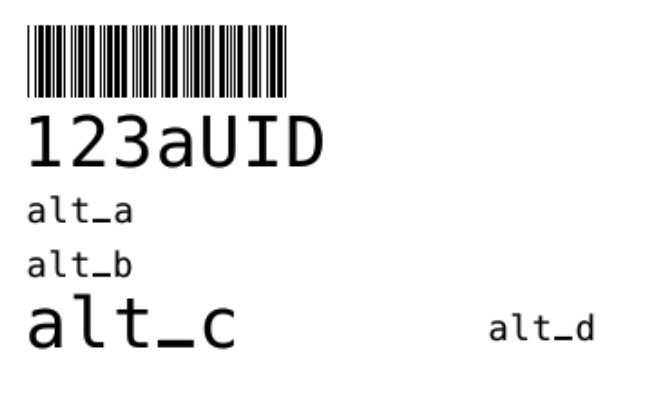

## zebra_day Overview [2.0.0](https://github.com/Daylily-Informatics/zebra_day/releases/tag/2.0.0)

### Build, Deploy, Run, Monitor, Teardown

```bash
# Build & Install (development mode)
pip install -e ".[dev]"

# Activate environment (for development)
source zday_activate      # Sets up env, installs package, enables tab completion

# Run Tests
pytest -v

# Run Linting (requires pip install -e ".[lint]")
ruff check zebra_day tests
black --check zebra_day tests
mypy zebra_day --ignore-missing-imports

# CLI Commands (new in 0.6.0)
zday --help               # Show all commands
zday bootstrap            # First-time setup: scan for printers
zday gui start            # Start web UI in background
zday gui stop             # Stop web UI
zday gui status           # Check if web UI is running

# Health Checks (use https:// if certificates are configured, http:// otherwise)
curl https://localhost:8118/healthz    # Basic health check
curl https://localhost:8118/readyz     # Readiness check (printer mgr initialized)

# API Documentation
# Visit https://localhost:8118/docs for interactive OpenAPI docs
# Visit https://localhost:8118/redoc for alternative API documentation
```

<ul>
    
<table border="1" > 
<tr >
<td > * auto discovery * of networked printers</td>
<td> ui configurable printer fleet details</td>
<td >zpl template drafting & live ui preview </td>
</tr>
<tr >
<td>monitor printer fleet status in one dashboard</td>
<td >simple and powerful python package offers ability to include barcode label printing in other s/w systems</td>
<td>fast and straight forward deployment and maintaince</td>
</tr>
<tr >
<td >directly access each printers admin console</td>
<td >integrate with other systems (Salesforce, AWS)</td>
<td > simple print API endpoints <hr>(commercial alternatives are quite expensive, and often offer less)</td>
</tr>
</table>
</ul>


<hr>

#### For The Impatient

<ul>
* Verify there are zebra printers connected & powered up to the same network that the PC you are installing this s/w to is connected.
    
```bash
python --version  # should be 3.10+  # advisable to run in some kind of venv

pip install zebra_day

# You should load a fresh env / open a fresh terminal so the package is available

# First-time setup: scan network for printers and initialize configuration
zday bootstrap

# Start the web UI (runs in background)
zday gui start
# Web UI available at http://0.0.0.0:8118

# Or start in foreground (for debugging)
zday gui start --foreground

# Check status
zday gui status
zday info

# Stop the server
zday gui stop
```
<ul>
  <a href=zebra_day/docs/zebra_day_ui_guide.md ><hr></a>
  
  > <a href=zebra_day/docs/zebra_day_ui_guide.md >ui capabilities full details</a>

#### Some UI Niceties
##### Zebra Printer Fleet Dashboard


##### Zebra Printer, Single Printer Detail View


 ##### ZPL Label Editing IRT


</ul>

### CLI Reference (0.6.0+)

The `zday` CLI provides a comprehensive interface for managing your Zebra printer fleet.

```bash
# Get help on any command
zday --help
zday gui --help
zday printer --help

# Core commands
zday info         # Show version, config paths, server status
zday status       # Show printer fleet status, service health
zday bootstrap    # First-time setup: scan network, initialize config

# GUI server management
zday gui start [--auth none|cognito] [--host HOST] [--port PORT] [--cert FILE] [--key FILE] [--no-https]
zday gui stop
zday gui status
zday gui logs [--tail N] [--follow]
zday gui restart

# Printer management
zday printer scan [--ip-stub IP]   # Scan network for printers
zday printer list [--lab LAB]      # List configured printers
zday printer test PRINTER_NAME     # Send test print

# Template management
zday template list                 # List ZPL templates
zday template preview TEMPLATE     # Generate PNG preview
zday template edit TEMPLATE        # Open in editor
zday template show TEMPLATE        # Display template contents

# Cognito authentication (requires pip install -e ".[auth]")
zday cognito status               # Show auth configuration
zday cognito info                 # Setup instructions
```

#### Migration from 0.5.x

The old commands `zday_start` and `zday_quickstart` still work but are deprecated:

| Old Command | New Command |
|-------------|-------------|
| `zday_quickstart` | `zday bootstrap && zday gui start` |
| `zday_start` | `zday gui start` |
| `zday_start --auth cognito` | `zday gui start --auth cognito` |

### Local HTTPS Setup

The zebra_day web UI supports HTTPS for secure local development. By default, HTTPS is enabled if certificates are found.

#### One-Time Setup (mkcert)

```bash
# Install mkcert
# macOS
brew install mkcert

# Ubuntu/Debian
sudo apt install mkcert

# Create and install local CA (one-time, requires password)
mkcert -install
```

#### Generate Certificates for zebra_day

```bash
# Create certificate directory
mkdir -p ~/.config/zebra_day/certs

# Generate locally-trusted certificates
mkcert -cert-file ~/.config/zebra_day/certs/server.crt \
       -key-file ~/.config/zebra_day/certs/server.key \
       localhost 127.0.0.1 ::1
```

#### HTTPS Options

| Method | Description |
|--------|-------------|
| **Auto-detect** | If certs exist in `~/.config/zebra_day/certs/`, HTTPS is enabled automatically |
| **Explicit paths** | `zday gui start --cert /path/to/cert.crt --key /path/to/key.key` |
| **Environment vars** | Set `SSL_CERT_PATH` and `SSL_KEY_PATH` |
| **Force HTTP** | `zday gui start --no-https` |

#### Verify HTTPS

```bash
# Start server (will use HTTPS if certs are found)
zday gui start

# Test connection
curl https://localhost:8118/healthz
```

#### Troubleshooting

| Issue | Solution |
|-------|----------|
| Browser shows "Not Secure" | Run `mkcert -install` to trust the local CA |
| Certificate not found | Check paths: `ls ~/.config/zebra_day/certs/` |
| Permission denied | Ensure cert files are readable: `chmod 644 ~/.config/zebra_day/certs/*` |
| Want HTTP only | Use `--no-https` flag: `zday gui start --no-https` |

### It Is 3+ Things

  (1) Zebra Printer Management & Configuration

  (2) ZPL Label Template Tools

  (3) A Python Library To Manage Formulating & Sending Label Print Requests

  (bonuses)
    * a web gui to make some of the above more approachable && expose (3) as a http API.
    * Documentation sufficent for organization to successfuly assemble & deploy a reasonalbly sized barcoding system in your operational environment in potentially weeks.
      * ... and cheaply! a 10 printer install could cost ~$5,000.00 in purchases.  With ongoing operational expenses of ~$150/mo (depends on label stock consumption mostly).

### And It Is Not

* _An Identify Generating Authority_
  * you will need to produce your own UID/GUID/etc. This can be manual, spreadsheets, custom code, various RDBMS, LIMS systems, Salesforce... but should not be tangled in this package.
    * also, METADATA regaring your UID is important as these metadata can be presented on the labels in addition to the human readable and scannable representation of the provided UID. [Unique Identifier Maxims](zebra_day/docs/uid_screed_light.md).

</ul>

## Getting Started

<ul>
  
### Facilitated :: Daylily Orchestrated Build and Deploy ( deliverable in ~1month )
* [Daylily is available to lead or contribute to the building and deployment of universal barcoding systems to your organizations operations](https://www.linkedin.com/in/john--major/). Daylily offers expertise with the entire process from evaluating existing operations systems, proposing integration options, securing all hardware, deploying hardware and software, and importantly: connecting newly deployed barcoding services to other LIS systems.

#### Universal Barcoding Capability Project Timing Estimates

<ul>
<ul>
  
> 

</ul>
</ul>

### Requirements
* Tested and runs on MAC and Ubuntu (but other flavors of Linux should be no problem). Windows would be a rather large hassle, though presumably possible.
* [conda](https://conda.io/projects/conda/en/latest/user-guide/install/index.html#regular-installation) and [mamba](https://anaconda.org/conda-forge/mamba) installed. This is not, in fact, a blocking requirement, but other env setups have not been tested yet.  __for MAC users, it may be advisable to install conda with homebrew__.
  * create conda environment `ZDAY`, which will be used to run the UI
    ```bash
    mamba create -n ZDAY -c conda-forge python==3.10 pip ipython
    ```
#### Nice To Have
 * For MAC address discovery, `arp` should be installed (both for MAC and Linux).
##### Ubuntu
  ```bash
  sudo apt-get install net-tools
  ```

##### MAC
  * Should be pre-installed by default.

### Install From PIP 
you can pip install `zebra_day` to any python environment running 3.10.*.  If you plan to run the web UI or use the HTTP API functionality, run this in the above described `ZDAY` conda env.  To install with pip:

```bash
pip install zebra_day
```
* reload your environment/shell.


### Install From Source

#### Clone Repository & Local PIP

*  [From github via ssh](https://github.com/Daylily-Informatics/zebra_day)

```bash
git clone git@github.com:Daylily-Informatics/zebra_day.git
cd zebra_day
conda activate ZDAY  # ZDAY was built with mamba earlier

# Modern install (recommended)
pip install -e .             # Install in editable mode
pip install -e ".[dev]"      # Include dev dependencies
pip install -e ".[lint]"     # Include linting tools
pip install -e ".[all]"      # Include all extras

# Build wheel/sdist
pip install build
python -m build              # Creates dist/*.whl and dist/*.tar.gz
```

* `zebra_day` is now installed in your current python environment.
* reload your environment/shell.

### File Locations (XDG-compliant)

zebra_day 0.6.0+ uses XDG Base Directory specification for file storage:

| Type | macOS | Linux |
|------|-------|-------|
| **Config** | `~/Library/Preferences/zebra_day/` | `~/.config/zebra_day/` |
| **Data** | `~/Library/Application Support/zebra_day/` | `~/.local/share/zebra_day/` |
| **Logs** | `~/Library/Logs/zebra_day/` | `~/.local/state/zebra_day/` |
| **Cache** | `~/Library/Caches/zebra_day/` | `~/.cache/zebra_day/` |

Key files:
- `printer_config.json` - Printer fleet configuration (in config dir)
- `label_styles/` - ZPL template files (in data dir)
- `label_styles/tmps/` - Draft templates (in data dir)

Use `zday info` to see the exact paths on your system.

<br><br><br>

</ul>


## Hardware Config
### Quick
* Connect all zebra printers to the same network as the machine you'll be running `zebra_day` is connected to. Load labels, power on printers , confirm status lights are green, etc.

### [Hardware Guide](zebra_day/docs/hardware_config_guide.md)
  * Info on hardware and consumables known to work with `zebra_day`.  User guides, notes, part#s and costs for:
      * Printers
      * Label Stock
      * Barcode Scanners


<br><br>

</ul>


# USAGE

<ul>

## QUICKSTART
* zebra printers -> power on and connect via cable or wifi to the same network the machine you installed `zebra_day` is on.
* activate the environment you have `zebra_day` installed into.
* If you have just pip installed `zebra_day` in the shell you are in, start a new shell.

```bash
# First-time setup: scan network for printers and initialize configuration
zday bootstrap

# Start the web UI (runs in background by default)
zday gui start

# Or start in foreground for debugging
zday gui start --foreground
```

### Example Output From `zday bootstrap`
<pre>
$ zday bootstrap

Detecting local IP address...
IP detected: 192.168.1.12 ... using IP root: 192.168.1

Scanning for Zebra printers on network (this may take a few minutes)...

Zebra Printer Scan Complete.
Found 2 printers:
  - 192.168.1.7 (ZTC GX420d)
  - 192.168.1.20 (ZD620)

Configuration saved to: ~/.config/zebra_day/printer_config.json

Run 'zday gui start' to launch the web interface.
</pre>

### Example Output From `zday gui start`
<pre>
$ zday gui start

Starting zebra_day web server...
Server running at: http://192.168.1.12:8118

Modern UI:  http://192.168.1.12:8118/
Legacy UI:  http://192.168.1.12:8118/legacy
API Docs:   http://192.168.1.12:8118/docs

Server started in background (PID: 12345)
Use 'zday gui status' to check status
Use 'zday gui stop' to stop the server
</pre>

  > The web service runs in the background. Use `zday gui status` to check if it's running, and `zday gui stop` to stop it.

#### zebra_day Web GUI

##### Home Page 
 

##### Zebra Fleet Auto Discovery & Status Report


##### Zebra Printer Fleet Config Json Editing

  One printer configured.


##### ZPL Template Drafting / Preview PNG / Test Print / Save 


##### Manual Print Requests


<br><br>
  

## Programatic
### Quick
Open an ipython shell.

```python
import zebra_day.print_mgr as zdpm

zlab = zdpm.zpl()

zlab.probe_zebra_printers_add_to_printers_json('192.168.1')  # REPLACE the IP stub with the correct value for your network. This may take a few min to run.  !! This command is not required if you've sucessuflly run the quickstart already, also, won't hurt.

print(zlab.printers)  # This should print out the json dict of all detected zebra printers. An empty dict, {}, is a failure of autodetection, and manual creation of the json file may be needed. If successful, the lab name assigned is 'scan-results', this may be edited latter.

# The json will loook something like this
## {'labs': {'scan-results': {'192.168.1.7': {'ip_address': '192.168.1.7', 'label_zpl_styles': ['test_2inX1in'], 'print_method': 'unk'}}}
##               'lab' name     'printer' name(can be edited latter)                              label_zpl_style

# Assuming a printer was detected, send a test print request.  Using the 'lab', 'printer' and 'label_zpl_style' above (you'd have your own IP/Name, other values should remain the same for now.  There are multiple label ZPL formats available, the test_2inX1in is for quick testing & only formats in the two UID values specified.

zlab.print_zpl(lab='scan-results', printer_name='192.168.1.7', label_zpl_style='test_2inX1in', uid_barcode="123aUID")
# ZPL code sent successfully to the printer!
# Out[13]: '^XA\n^FO235,20\n^BY1\n^B3N,N,40,N,N\n^FD123aUID^FS\n^FO235,70\n^ADN,30,20\n^FD123aUID^FS\n^FO235,115\n^ADN,25,12\n^FDalt_a^FS\n^FO235,145\n^ADN,25,12\n^FDalt_b^FS\n^FO70,180\n^FO235,170\n^ADN,30,20\n^FDalt_c^FS\n^FO490,180\n^ADN,25,12\n^FDalt_d^FS\n^XZ'
```

* This will produce a label which looks like this (modulo printer config items needing attention).
  


### [Programatic Guide](zebra_day/docs/programatic_guide.md)


<br><br>

## Print Request HTTP API

### Quick Start

The HTTP API is available via the web UI, and can be used programatically as well.  The following is a quick example of how to send a print request via the HTTP API.

```bash
curl "http://localhost:8118/_print_label?lab=MA&printer=192.168.1.31&printer_ip=&label_zpl_style=tube_2inX1in&uid_barcode=BARCODE&alt_a=FIELDAAAA&alt_b=FIELDBBBB&alt_c=FIELDCCCC&alt_d=FIELDDDD&alt_e=FIELDEEEE&alt_f=FIELDFFFF"

  # RETURNS 200 OK -or- 500 Internal Server Error (usually b/c the target printer is not reachable)

```
  > The above would send a print request to the specified printer, identified by it's network IP. Label style can be set, and some styles use more `alt_*` fields than others.  This reuest will return `200` or `500`.   

## Web UI

### Quick Start

```bash
# Start the web server (runs in background)
zday gui start

# Check status
zday gui status

# View logs
zday gui logs --tail 50

# Stop the server
zday gui stop

# Or run in foreground for debugging
zday gui start --foreground

# Or run via uvicorn directly (more control over options)
uvicorn zebra_day.web.app:create_app --host 0.0.0.0 --port 8118 --factory
```

### Modern vs Legacy UI

zebra_day 0.6.0+ includes a redesigned modern UI alongside the preserved legacy interface:

| Interface | URL | Description |
|-----------|-----|-------------|
| **Modern UI** | `https://localhost:8118/` | New dashboard with stats, quick actions, improved navigation |
| **Legacy UI** | `https://localhost:8118/legacy` | Original interface, fully functional |
| **API Docs** | `https://localhost:8118/docs` | Interactive OpenAPI/Swagger documentation |
| **ReDoc** | `https://localhost:8118/redoc` | Alternative API documentation |

> **Note:** Use `http://` instead of `https://` if running without certificates (`--no-https`).

Both interfaces provide full functionality. The modern UI offers:
- Dashboard with printer fleet statistics
- Streamlined navigation
- Improved template editor
- Better mobile responsiveness

### Print via HTTP API

```http
http://YOUR.HOST.IP.ADDR:8118/_print_label?lab=scan-results&printer=192.168.1.7&label_zpl_style=test_2inX1in&uid_barcode=123aUID
```

* See the [Web UI Guide](zebra_day/docs/zebra_day_ui_guide.md) for full details.

### [Web UI Guide](zebra_day/docs/zebra_day_ui_guide.md)


<br><br>

</ul>


# Other Topics

## Security

### Authentication

zebra_day supports optional AWS Cognito authentication for production deployments.

#### Enabling Cognito Authentication

1. **Install auth dependencies**:
   ```bash
   pip install -e ".[auth]"
   ```

2. **Set required environment variables**:
   ```bash
   export COGNITO_USER_POOL_ID="us-west-2_XXXXXXXXX"
   export COGNITO_APP_CLIENT_ID="your-app-client-id"
   export COGNITO_REGION="us-west-2"  # Optional, defaults to us-west-2
   export AWS_PROFILE="your-profile"   # Optional, for local development
   ```

3. **Start server with authentication**:
   ```bash
   zday gui start --auth cognito

   # Check auth status
   zday cognito status
   ```

#### Authentication Modes

| Mode | CLI Flag | Description |
|------|----------|-------------|
| None (default) | `--auth none` | No authentication required. All endpoints are publicly accessible. |
| Cognito | `--auth cognito` | AWS Cognito JWT authentication. All endpoints except health checks require a valid Bearer token. |

#### Protected Endpoints

When `--auth cognito` is enabled:
- All UI and API endpoints require a valid JWT Bearer token
- Health endpoints (`/healthz`, `/readyz`) remain publicly accessible
- Static files (`/static/*`, `/files/*`, `/etc/*`) remain publicly accessible
- API documentation (`/docs`, `/redoc`, `/openapi.json`) remains accessible

#### Making Authenticated Requests

Include the JWT token in the Authorization header:
```bash
curl -H "Authorization: Bearer YOUR_JWT_TOKEN" https://localhost:8118/api/v1/printers
```

### Secrets
No credentials of any kind are stored or used by `zebra_day`. It solely offers zebra printer management and label print request formatting and brokering services.  It does not need to know how to connect to other systems, other systems will use the library code provided here, or the http api.

### Host and Network Security
In it's present state, `zebra_day` is safe to run on a machine located in a properly configured & secure local network or cloud hosted instance residing in a secure VPN/VPC.
  * `zebra_day` should not be deployed in such a way the host is fully visible to the public internet.
    * a potential exception would be exposing the service via an encryped and secure open port. __POC demonstrating this concept can be found below__.

### Programatic Use Of `zebra_day` Package/Library
Using the python library in other python code poses no particularly unique new risk. `zebra_day` may be treated similarly to how other third party tools are handled in each users organization.

## Regulatory & Compliance
### HIPAA / CAP / CLIA
No PHI is needed by `zebra_day` to function.  PHI may be sent in print rquests, each organization will have their own use cases. `zebra_day` does not store any of the print request metadata sent to it, the info is redirected to the appropriate zebra printer, and that is that.  It is straightforward when setting up the host machine/environment this package will be running in to check off the various HIPAA and CAP/CLIA expectations where they apply.


# A Few Integration Demonstrations

# Send Label Print Requests From Public Internet To Host PC w/In Your Private Network

## Ditch The Private Local Network & Expose Server Publicly ( not advised )
really

## Using NGROK To Present A Tunneled Port Connected To The `zebra_day` Host Port (up and running in <5 min!)

* Create a tunnel to connect to the zebra_day service running on a machine within your network on port 8118.  This could be a cloud instance w/in a VPC you control, or a machine physically present w/in your network.

* [NGROK DOCS]( https://dashboard.ngrok.com/get-started/setup/macos)

### Install ngrok

```bash
brew install ngrok/ngrok/ngrok
ngrok config add-authtoken MYTOKEN  # you get this once registered (its free!)
```

### Running ngrok
```bash
ngrok http 8118
```

Which starts a tunnel and presents a monitoring dashboard.  And it looks like this:
<pre>
ngrok                                                                                (Ctrl+C to quit)
                                                                                                     
Introducing Always-On Global Server Load Balancer: https://ngrok.com/r/gslb                          
                                                                                                     
Session Status                online                                                                 
Account                       USERNAME (Plan: Free)                                      
Version                       3.3.5                                                                  
Region                        United States (California) (us-cal-1)                                  
Latency                       12ms                                                                   
Web Interface                 http://127.0.0.1:4040                                                  
Forwarding                    https://dfbf-23-93-175-197.ngrok-free.app -> http://localhost:8118

Connections                   ttl     opn     rt1     rt5     p50     p90
                              8       0       0.00    0.01    10.03   28.05

HTTP Requests
-------------

GET /_print_label              200 OK
GET /_print_label              200 OK
GET /build_print_request       200 OK
GET /send_print_request        200 OK
GET /                          200 OK
GET /_print_label              200 OK
GET /_print_label              200 OK
GET /build_print_request       200 OK
GET /send_print_request        200 OK
GET /favicon.ico               200 OK        ~
</pre>

And looks like:


* If you leave the ngrok tunnel running, go to a different network, you can use the link named in the `Forwarding` row above to access the zebra_day UI, in the above example, this url would be `https://dfbf-23-93-175-197.ngrok-free.app`.

#### Sending Label Print Requests
##### from a web browser on a different network

`https://dfbf-23-93-175-197.ngrok-free.app/_print_label?uid_barcode=UID33344455&alt_a=altTEXTAA&alt_b=altTEXTBB&alt_c=altTEXTCC&alt_d=&alt_e=&alt_f=&lab=scan-results&printer=192.168.1.20&printer_ip=192.168.1.20&label_zpl_style=tube_2inX1in`

##### Using wget from a shell on a machine outside your local network
```bash
wget "https://dfbf-23-93-175-197.ngrok-free.app/_print_label?uid_barcode=UID33344455&alt_a=altTEXTAA&alt_b=altTEXTBB&alt_c=altTEXTCC&alt_d=&alt_e=&alt_f=&lab=scan-results&printer=192.168.1.20&printer_ip=192.168.1.20&label_zpl_style=tube_2inX1in"
```

### From SalesForce

 * There are several ways to do this, but they all boil down to somehow formulating a URL for each print request, ie: `https://dfbf-23-93-175-197.ngrok-free.app/_print_label?uid_barcode=UID33344455&lab=scan-results&printer=192.168.1.20&label_zpl_style=tube_2inX1in`, and hitting the URL via Apex, Flow, etc.
   * To send a print request, you will need to know the API url, and the `lab`, `printer_name`, and `label_zpl_style` you wish to print the salesforce `Name` aka `UID` as a label.  This example explains how to pass just one variable to print from salesforce, adding additional metadata to print involves adding additional params to the url being constructed.


#### Print Upon Object Creation (Apex Class + Flow)

> The following is a very quick prof of concept to see it work(success!). I fully expect there are more robust ways to reach this goal.

Create an Apex class to handle sending HTTP requests.

* Setup->Apex Classes, create new Apex Class, save the following as the Apex Class:

```java
public class HttpRequestFlowAction {

    public class RequestInput {
        @InvocableVariable(label='Endpoint URL' required=true)
        public String url;
        
        // Add other variables as needed, e.g. headers, body, method, etc.
    }
    
    @InvocableMethod(label='Make HTTP Request' description='Makes an HTTP request from a Flow.')
    public static List<String> makeHttpRequest(List<RequestInput> requests) {
        List<String> responses = new List<String>();
        
        for(RequestInput req : requests) {
            Http http = new Http();
            HttpRequest request = new HttpRequest();
            request.setEndpoint(req.url);
            request.setMethod('GET');  // Change method as needed: POST, PUT, etc.
            
            // Add headers, body, etc. if needed.
            
            HttpResponse response = http.send(request);
            responses.add(response.getBody());
        }
        
        return responses;
    }
}
```

* click save, the apex class is now ready.  Check the security settings and verify the profile associated with your user has access to see/use this class.

Next, create a flow which uses this Apex Class.

* setup->Flow & click `New Flow`.  I remained in the `Auto Layout` view.
* Choose `Record-Triggered Flow`
* Select the object type the flow will be triggered when an instance of this object type is created.
* Select 'A record is created` as the trigger.
* Set Entry Conditions (this might be unecessary), `Any Condition Is Met`, Field `Name`, Operator `Starts with`, Value `X`(X being the first letter of the Name field UID salesforce creates for this object.  Again, this is probably not needed, but I have not gone back to try w/out this step).
* Choose `Actions and Related Records`, and check the box at the bottom of the page to `Include a Run Asynchronously path...`
  * upon clicking this box, the graphic representation of the flow to the left of the page will now have 2 branches at the bottom of the flow rule, one `Run Immediately` and one `Run Asynchronously`.  The `Run Immediately` branch was throwing errors, so I removed it to debug at a latter date.
  * Click the node just below the `Run Asynch` oval. Add an `Action`. Select the `Make HTTP Request` we created via the Apex Class above.  Give it a `Label`, let the API Name auto generate.
  * In the `Endpoint URL` field, enter the url `https://dfbf-23-93-175-197.ngrok-free.app/_print_label?uid_barcode={!$Record.Name}&lab=scan-results&printer=!!YOURPRINTERIP!!&label_zpl_style=tube_2inX1in`, where Record.Name will be replaced with the Object.Name from the object triggering the flow.  Replace !!YOURPRINTERIP!! with one of the printer IPs zebra_day detected above.  If you are using the auto-generated zebra printers config json file, you may leave `scan-results` as the value for `lab=` as this will be the default name given when zebra_day autodetects printers.
  * add the same HTTPrequest action to the node just below `Run Immediately`.
  * click `Save` in the upper right corner of the page. Give it a name
  * Click `Debug Again`, run the `Run Immediately` branch first. This will fail.
  * You need to whitelist the URL used by Apex in this flow with Salesforce.  To do this: Setup->Remote Site Settings, click `New Remote Site`.  Give it a name, and enter your ngrok URL up to the `.app`, so: `https://dfbf-23-93-175-197.ngrok-free.app`. Click the `active` checkbox and then save.
  * CLick `Debug Again`, run the `Asyncronous` branch, this should succeed.
  * Click `Save As`, new version.
  * Click `Activate`
  * Go create one of the objects you made this flow for. This will fail!
  * Go back to your flow, click `edit flow`, switch from `Auto Layout` to `Freeform` view.
  * Click the connector labeled `Run Immediately`, delete it (leave the Async branch intact)
  * Click `Save As`, new version.
  * Click `Activate`
  * Go create a new object of the type this trigger is built to respond to... it should print, and should do so each time a new object is created.
* This toy example is intended to demonstrate this can work. Next, you should determine how you'd like to send print requests that best suits your needs.

> This was all rather a PITA honestly.

###### Create a Formula Text Field For Objects
You can construct the print URL in the formula, and this formula field can be presented on the object salesforce page.  If the user clicks the URL on the page, a print request is sent containing the data inserted by the formula for the current object.


## Host Machine Options
### Machine physically connected to your local network.
This is covered in the config and setup/install instructions above.

### AWS
#### ec2 instance
more info coming soon.  The instructions for getting the package s/w up and running is largely the same as above. However, care must be taken when configuring the network and instances which will be used at amazon.

##### From AMI?


## Other Providers
If it will work on AWS, it will work anyplace really (with some provider specific tweaks).

## Docker
Find an example in the docker folder at the top level of this project. Copy the Dockerfile and the docker-compose.yml to a local folder on your computer.
In that folder, `mkdir etc && chmod 777 etc && mkdir logs && chmod 777 logs` to setup the example folders.
Tthen run `sudo docker compose up --build -d` to run it then reach it at http://<your-ip>:8118. This doesn't auto-detect printers so you'll have to run the printer discovery and probably manually edit your JSON file.

# Add'l Future Development

  * Set varios printer config via ZPL commands (presently this package only fetches config).


# BadgeLand

[](https://github.com/Daylily-Informatics/zebra_day/actions/workflows/main.yaml)

<br>
 
 
 
