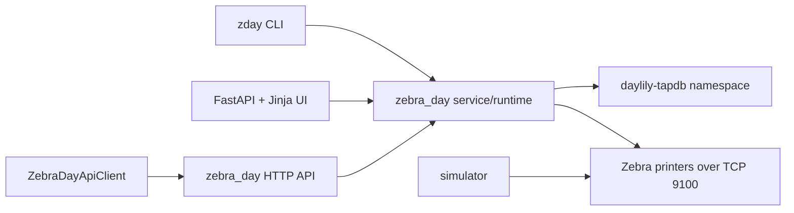

# zebra_day

`zebra_day` is a Python library, CLI, simulator, and FastAPI web service for managing Zebra printer fleets and serving ZPL print workflows. Shared fleet state, templates, label profiles, observations, and print jobs now live in `daylily-tapdb` only.

## What Changed

- TapDB is the only supported shared datastore.
- `source ./activate <deploy-name>` is the only supported repo activation path.
- The service/admin runtime uses direct TapDB access through `ZebraDayClient`.
- Downstream Python applications should use `ZebraDayApiClient` against a running zebra_day API.
- Cognito is the default auth mode. `--no-auth` remains the explicit runtime override.

Removed in this major cut:

- local fleet/config files as runtime state
- DynamoDB and S3 runtime support
- `print_mgr.zpl()` and package-root helper shims
- `zday_start`, `zday_quickstart`, and `zday dynamo`

## Quickstart

```bash
source ./activate local
zday config init
zday config status
zday gui start
```

The default GUI port is `8118`. HTTPS is enabled automatically when local certs are available.

## Runtime Model


```mermaid
flowchart LR
    CLI["zday CLI"] --> Service["zebra_day service/runtime"]
    GUI["FastAPI + Jinja UI"] --> Service
    APIClient["ZebraDayApiClient"] --> API["zebra_day HTTP API"]
    API --> Service
    Service --> TapDB["daylily-tapdb namespace"]
    Service --> Printers["Zebra printers over TCP 9100"]
    Simulator["simulator"] --> Printers
```

## Python Usage

Direct service/admin usage:

```python
from zebra_day import ZebraDayClient, ZebraDaySettings

settings = ZebraDaySettings.from_context("local")
client = ZebraDayClient(settings)
printers = client.list_printers("default")
```

Downstream app usage:

```python
from zebra_day import ZebraDayApiClient

with ZebraDayApiClient("https://localhost:8118", api_key="internal-token") as client:
    printers = client.list_printers("default")
    client.submit_print_job(
        lab="default",
        printer="printer-1",
        label_zpl_style="tube_2inX1in",
        uid_barcode="SAMPLE-001",
    )
```

## CLI Surface

- `zday gui ...`: start, stop, restart, and inspect the GUI server
- `zday printer ...`: list, scan, and sync printers
- `zday template ...`: list, show, save, preview, and delete templates
- `zday tapdb ...`: pass through to TapDB lifecycle commands
- `zday cognito ...`: inspect or validate the daycog-backed auth contract
- `zday users ...`: manage Cognito group membership for operator/admin roles
- `zday logs ...`: inspect zebra_day GUI logs

## Docs

- [docs/README.md](docs/README.md)
- [zebra_day/docs/programatic_guide.md](zebra_day/docs/programatic_guide.md)
- [zebra_day/docs/zebra_day_ui_guide.md](zebra_day/docs/zebra_day_ui_guide.md)
- [docs/tapdb_hard_migration_plan.md](docs/tapdb_hard_migration_plan.md)

## Development Checks

```bash
ruff check zebra_day tests
ruff format --check zebra_day tests
mypy zebra_day --ignore-missing-imports
pytest tests/ -v --tb=short
```
 
